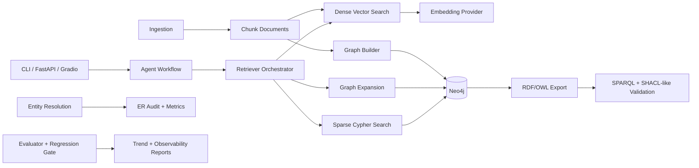

# Architecture Source of Truth

This document is the architecture reference for contributors and GitHub Copilot.
The rules file at `.github/copilot-instructions.md` uses this document as the
source of truth for package boundaries, entry points, ownership, and
architectural guardrails. In this repository, it serves the role that some
projects call `docs/copilot_architecture.md`.

## System Diagram

## How To Read This Repository

The package is organized as a layered GraphRAG application over the
Riskfolio-Lib codebase and documentation.

- `ingestion` turns source files and docs into chunked `Document` records.
- `graph` extracts and stores structured entities, relationships, and graph exports.
- `retrieval` converts a user question into ranked evidence chunks using dense, sparse, graph, or hybrid retrieval.
- `agent` plans, retrieves, reasons, and verifies before producing an answer.
- `app` exposes the system through FastAPI and Gradio.
- `eval`, `er`, and `observability` measure quality, entity resolution, and operational behavior.

## Layer Boundaries

### Ingestion Layer

Responsibility: read source material, chunk it, and produce typed documents.

Inputs: filesystem content from Riskfolio-Lib source, docs, examples, and tests.

Outputs: `Document` objects with content, chunk identity, line ranges, and metadata.

Must not: answer questions, rank retrieval results, or generate graph responses.

### Graph Layer

Responsibility: build and query the knowledge graph and related semantic exports.

Inputs: chunked documents and configured ontology or extraction logic.

Outputs: Neo4j nodes and edges, graph stats, subgraphs, and semantic export artifacts.

Must not: own final answer generation or UI rendering.

### Retrieval Layer

Responsibility: retrieve and rank evidence for a query.

Inputs: user query, vector backend, Neo4j graph, and embedding provider.

Outputs: ranked `RetrievalResult` evidence with citation-friendly metadata.

Must not: build the graph, orchestrate the full agent workflow, or produce the final narrative answer.

### Agent Layer

Responsibility: coordinate planning, retrieval, reasoning, and verification.

Inputs: user question, retriever, optional query router, optional LLM generator.

Outputs: answer text, citations, verification status, and workflow state.

Must not: own ingestion or graph construction concerns.

### App Layer

Responsibility: expose stable user-facing interfaces.

Inputs: HTTP requests, CLI invocations, and interactive UI events.

Outputs: API responses, terminal output, demo UI state, and graph visualizations.

Must not: bury core business logic in handlers when it belongs in lower layers.

## Module Ownership Map

| Module | Responsibility | Notes |
|---|---|---|
| `src/riskfolio_graphrag_agent/config/settings.py` | Environment-driven runtime configuration | Centralizes settings used across CLI, server, and app surfaces. |
| `src/riskfolio_graphrag_agent/ingestion/loader.py` | Directory walking, chunking, and `Document` creation | Primary source of chunk metadata consumed downstream. |
| `src/riskfolio_graphrag_agent/graph/builder.py` | Ontology-aware extraction and Neo4j upserts | Owns domain aliases and graph-building logic. |
| `src/riskfolio_graphrag_agent/graph/nl2cypher_guard.py` | Guarded NL-to-Cypher patterns and audit controls | Safety layer for graph querying features. |
| `src/riskfolio_graphrag_agent/graph/semantic_interop.py` | RDF/OWL export and semantic validation helpers | Bridges graph data into semantic-web style artifacts. |
| `src/riskfolio_graphrag_agent/retrieval/embeddings.py` | Embedding provider abstraction and resolution | Keeps embedding selection separate from retrieval orchestration. |
| `src/riskfolio_graphrag_agent/retrieval/router.py` | Query-to-retrieval-mode routing | Chooses between dense, sparse, graph, and hybrid modes. |
| `src/riskfolio_graphrag_agent/retrieval/retriever.py` | Evidence retrieval and graph-aware reranking | Main retrieval entry point used by the agent layer. |
| `src/riskfolio_graphrag_agent/agent/workflow.py` | Multi-step plan, retrieve, reason, verify flow | Orchestrates answer production over retrieved evidence. |
| `src/riskfolio_graphrag_agent/eval/evaluator.py` | Retrieval and answer quality evaluation | Produces quality scorecards and evaluation artifacts. |
| `src/riskfolio_graphrag_agent/eval/regression_gate.py` | Regression thresholds and CI gating | Encodes pass-fail gates over evaluation output. |
| `src/riskfolio_graphrag_agent/er/pipeline.py` | Entity resolution pipeline and metrics | Supports ER auditability and quality measurement. |
| `src/riskfolio_graphrag_agent/observability/reporting.py` | SLI, freshness, and drift reporting | Operational reporting rather than product behavior. |
| `src/riskfolio_graphrag_agent/app/server.py` | FastAPI endpoints and request orchestration | HTTP surface over workflow and graph services. |
| `src/riskfolio_graphrag_agent/app/gradio_ui.py` | Gradio UI orchestration and graph visualization | Demo-oriented interactive surface. |
| `src/riskfolio_graphrag_agent/cli.py` | Typer CLI commands | Operational entry point for ingest, build, eval, and serving. |
| `app.py` | Hugging Face Spaces launcher | Thin deployment wrapper for the Gradio app. |
| `scripts/run_integration_smoke.sh` | Reproducible integration smoke workflow | Convenience script, not core library logic. |

## Entry Points

These files are the primary public entry points into the system:

| Entry Point | Audience | Purpose |
|---|---|---|
| `src/riskfolio_graphrag_agent/cli.py` | Developers and operators | Run ingestion, graph build, stats, evaluation, API server, and Gradio UI. |
| `src/riskfolio_graphrag_agent/app/server.py` | API consumers | Serve `/health`, `/query`, `/graph/stats`, and related HTTP endpoints. |
| `src/riskfolio_graphrag_agent/app/gradio_ui.py` | Demo and exploration users | Provide interactive Q&A with graph visualization. |
| `app.py` | Deployment platform | Start the Gradio app in Spaces-style environments. |

## Architectural Guardrails

- Keep retrieval independent from final answer generation. Retrieval returns evidence, not polished narrative output.
- Keep graph extraction and ontology concerns in graph, even if retrieval uses graph data.
- Keep query routing separate from retrieval execution. `router.py` decides; `retriever.py` executes.
- Keep HTTP and UI adapters thin. Request parsing and response formatting may live there, but reusable logic should move down into package modules.
- Prefer explicit metadata contracts on documents, hits, citations, and API payloads. These objects cross module boundaries and should stay easy to reason about.
- Preserve deterministic fallbacks where possible. The repo is a demo and evaluation artifact, so predictable behavior matters.
- Add new top-level packages only when an existing package boundary is clearly insufficient.

## Documentation Split

Use the following split to avoid duplication:

- `.github/copilot-instructions.md`: strict rules for generated code and docs.
- `README.md`: project overview, setup, and demo framing.
- `docs/quickstart.md`: concise operational usage.
- This document: architecture map, boundaries, entry points, and design guardrails.

## When This Document Must Change

Update this file when any of the following changes:

- A new top-level package or major module is introduced.
- Ownership of a responsibility moves between packages.
- A public entry point is added, removed, or materially repurposed.
- Cross-layer dependencies are introduced that change the intended architecture.
- Architectural guardrails or non-obvious package boundaries change.

## Current Non-Goals

This architecture does not aim to provide:

- a general-purpose financial advisory system,
- deep autonomous graph reasoning beyond bounded retrieval expansion,
- unrestricted natural-language-to-Cypher generation,
- a single monolithic service layer that combines ingestion, graph build, retrieval, and UI logic.
