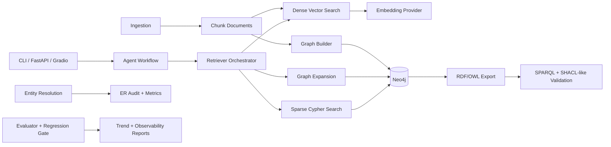

# Architecture Diagram and Module Map

## Module Map

| Module | Purpose |
|---|---|
| `src/riskfolio_graphrag_agent/retrieval/retriever.py` | Dense/sparse/graph/hybrid retrieval with graph rerank |
| `src/riskfolio_graphrag_agent/retrieval/embeddings.py` | Pluggable embedding provider abstraction and fallback policy |
| `src/riskfolio_graphrag_agent/graph/builder.py` | Domain ontology extraction and Neo4j upserts |
| `src/riskfolio_graphrag_agent/graph/semantic_interop.py` | RDF/OWL export, SPARQL examples, SHACL-like validation |
| `src/riskfolio_graphrag_agent/graph/nl2cypher_guard.py` | Guarded NL-to-Cypher templates, safety checks, audit logging |
| `src/riskfolio_graphrag_agent/er/pipeline.py` | Deterministic + model-assisted ER and ER P/R/F1 metrics |
| `src/riskfolio_graphrag_agent/eval/evaluator.py` | Enterprise scorecard (faithfulness, grounding, multi-hop, link metrics, latency, cost) |
| `src/riskfolio_graphrag_agent/eval/regression_gate.py` | CI gating and trend tracking artifacts |
| `src/riskfolio_graphrag_agent/observability/reporting.py` | SLI/SLO status and drift/freshness reporting |
| `src/riskfolio_graphrag_agent/app/server.py` | FastAPI endpoints, tracing attributes, guarded graph query route |
| `scripts/run_integration_smoke.sh` | One-command reproducible integration profile |
