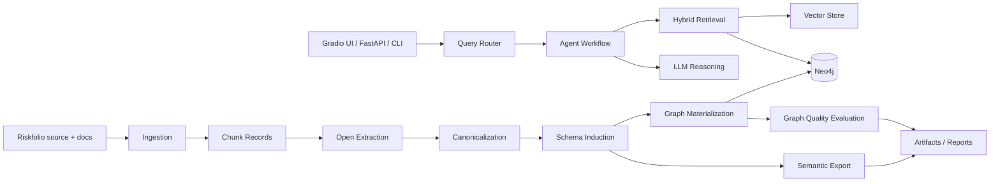

# Architecture Source of Truth

This document is the architecture reference for contributors and GitHub Copilot.
The rules file at `.github/copilot-instructions.md` uses this document as the
source of truth for package boundaries, entry points, ownership, and
architectural guardrails.

## System Diagram

```mermaid
flowchart LR
  UI[Gradio UI / FastAPI / CLI] --> QR[Query Router]
  QR --> AW[Agent Workflow]
  AW --> RET[Hybrid Retrieval]
  RET --> VDB[Vector Store]
  RET --> NEO[(Neo4j)]
  AW --> LLM[LLM Reasoning]
  SRC[Riskfolio source + docs] --> ING[Ingestion]
  ING --> CH[Chunk Records]
  CH --> EXT[Open Extraction]
  EXT --> CAN[Canonicalization]
  CAN --> SCH[Schema Induction]
  SCH --> MAT[Graph Materialization]
  MAT --> NEO
  SCH --> SEM[Semantic Export]
  MAT --> GQ[Graph Quality Evaluation]
  GQ --> ART[Artifacts / Reports]
  SEM --> ART
```

## Repository Reading Order

Read the repository in this order when you need the real architecture rather
than the legacy compatibility path:

1. `ingestion` for source chunk contracts.
2. `kg_models.py` for shared typed records across graph layers.
3. `extraction`, `canonicalization`, and `schema_induction` for upstream KG induction.
4. `graph_materialization` and `semantic_export` for operational and semantic projections.
5. `evaluation/graph_quality.py` for graph-quality hooks.
6. `retrieval`, `agent`, and `app` for runtime query behavior.

## Layer Boundaries

### Ingestion Layer

Responsibility: read source material, chunk it, and produce typed documents.

Inputs: filesystem content from Riskfolio-Lib source, docs, examples, and tests.

Outputs: `Document` objects with content, chunk identity, line ranges, and metadata.

Must not: answer questions, canonicalize entities, or materialize retrieval graphs.

### Extraction Layer

Responsibility: perform open-world extraction over chunks.

Inputs: `Document` records.

Outputs: source records, mentions, candidate entities, candidate assertions, candidate events, evidence spans, and extraction metadata.

Must not: force early ontology commitments or collapse away mention-level provenance.

### Canonicalization Layer

Responsibility: cluster entities, relation phrases, and event-type guesses into reviewable canonical records.

Inputs: open extraction artifacts.

Outputs: canonical entities, canonical predicates, canonical event types, and explicit canonicalization decisions.

Must not: claim final ontology truth or flatten provenance into simple aliases.

### Schema Induction Layer

Responsibility: aggregate open semantic guesses into reviewable schema proposals and stabilized ontology elements.

Inputs: open extraction artifacts and canonicalization results.

Outputs: schema candidates, ontology classes, ontology properties, concept schemes, and review artifacts.

Must not: write runtime retrieval graphs directly or pretend proposed schema is already reviewed truth.

### Graph Materialization Layer

Responsibility: map promoted semantic records into an operational Neo4j retrieval graph.

Inputs: extraction outputs, canonicalization results, and schema induction outputs.

Outputs: constraint statements, materialized nodes and edges, and retrieval-oriented Cypher queries.

Must not: re-run extraction logic or own answer generation.

### Semantic Export Layer

Responsibility: provide a semantically disciplined RDF view over the stabilized graph.

Inputs: schema induction outputs and the promoted graph write plan.

Outputs: ontology Turtle, instance/provenance Turtle, and semantic export summaries.

Must not: overstate ontology completeness or hide provenance.

### Retrieval Layer

Responsibility: retrieve and rank evidence for a query.

Inputs: user query, vector backend, Neo4j graph, and embedding provider.

Outputs: ranked `RetrievalResult` evidence with citation-friendly metadata.

**Supported retrieval modes**:

- **Dense**: Embedding-based semantic similarity with query expansion. Uses `2×top_k` candidate pool before final truncation. Fast and broad; good for paraphrased queries.
- **Sparse**: Lexical token matching over Neo4j chunks. Direct keyword search; precise for domain terminology but weak on synonyms.
- **Graph**: Shallow assertion-aware traversal with `3×top_k` candidate pool. Combines promoted seed matching (CanonicalEntity → Assertion → Chunk), ontology-class expansion (OntologyClass → CanonicalEntity → Assertion → Chunk), assertion-bridged peer entities, and sparse backfill. Slowest but captures semantic relationships.
- **Hybrid Rerank**: Merges dense and sparse results from `2×top_k` each, then applies graph-contextualized evidence boosts. Balances precision and recall; default mode.

All modes (except sparse) apply optional reranking boosts based on entity density, graph neighbourhood connectivity, and query token coverage. In ``hybrid_rerank`` mode, an optional learned reranker (e.g. ``CrossEncoderReranker``) can be configured for a final re-scoring pass after the heuristic boosts. See `docs/retrieval_methods.md` for detailed mode descriptions, formulas, and performance profiles.

Must not: own graph induction or final answer narration.

### Agent Layer

Responsibility: coordinate planning, retrieval, reasoning, and verification.

Inputs: user question, retriever, optional query router, optional LLM generator.

Outputs: answer text, citations, verification status, and workflow state.

Must not: own ingestion, canonicalization, schema induction, or graph materialization.

### App Layer

Responsibility: expose stable user-facing interfaces.

Inputs: HTTP requests, CLI invocations, and interactive UI events.

Outputs: API responses, terminal output, demo UI state, and graph visualizations.

Must not: bury core business logic in handlers when it belongs in lower layers.

## Module Ownership Map

| Module | Responsibility | Notes |
|---|---|---|
| `src/riskfolio_graphrag_agent/config/settings.py` | Environment-driven runtime configuration | Shared settings across CLI, server, and app surfaces. |
| `src/riskfolio_graphrag_agent/ingestion/loader.py` | Directory walking, chunking, and `Document` creation | Primary source of chunk metadata consumed downstream. |
| `src/riskfolio_graphrag_agent/kg_models.py` | Shared typed contracts for KG induction layers | New source of truth for the redesigned graph pipeline record model. |
| `src/riskfolio_graphrag_agent/extraction/pipeline.py` | Open chunk-level extraction | Produces mentions, candidate entities, candidate assertions, and candidate events. |
| `src/riskfolio_graphrag_agent/canonicalization/pipeline.py` | Canonicalization decisions and canonical semantic records | Stronger than alias lookup, even in the current heuristic vertical slice. |
| `src/riskfolio_graphrag_agent/schema_induction/pipeline.py` | Reviewable schema induction and ontology proposal generation | Produces schema candidates, ontology classes/properties, and concept schemes. |
| `src/riskfolio_graphrag_agent/graph_materialization/pipeline.py` | Neo4j write plans and representative Cypher queries | Keeps retrieval graph narrower than upstream open extraction. |
| `src/riskfolio_graphrag_agent/semantic_export/pipeline.py` | OWL/SKOS/PROV export over stabilized layers | Replaces the old direct registry-dump style export path. |
| `src/riskfolio_graphrag_agent/evaluation/graph_quality.py` | Graph-quality metrics for KG induction | Complements answer-quality evaluation in `eval/`. |
| `src/riskfolio_graphrag_agent/kg_pipeline.py` | End-to-end redesigned KG orchestration | Writes stage artifacts and can persist the promoted graph to Neo4j. |
| `src/riskfolio_graphrag_agent/graph/builder.py` | Deterministic graph builder using domain aliases and taxonomy edges | Used by server and Gradio UI for graph stats and subgraph queries; also provides the `build-graph` CLI path for alias-driven graph construction. |
| `src/riskfolio_graphrag_agent/graph/semantic_interop.py` | Semantic export helpers for RDF/OWL output from the legacy graph | Superseded by `semantic_export/` for new KG pipeline runs; still used for structural validation tests. |
| `src/riskfolio_graphrag_agent/retrieval/retriever.py` | Evidence retrieval and graph-aware reranking | Implements four retrieval modes: dense, sparse, graph, and hybrid_rerank. Graph mode uses the promoted assertion-aware graph (CanonicalEntity, Assertion, OntologyClass) with sparse backfill for coverage gaps. Accepts an optional ``Reranker`` that is applied as the final ranking step in ``hybrid_rerank`` mode. See `docs/retrieval_methods.md` for detailed mode descriptions and performance profiles. |
| `src/riskfolio_graphrag_agent/retrieval/reranker.py` | Reranker protocol and implementations | Defines the ``Reranker`` protocol, ``PassthroughReranker`` (no-op), and ``CrossEncoderReranker`` (local cross-encoder via ``sentence_transformers``). Also exposes ``build_reranker`` factory for settings-driven construction. Used by ``HybridRetriever`` in ``hybrid_rerank`` mode. |
| `src/riskfolio_graphrag_agent/retrieval/router.py` | Query-to-retrieval-mode routing | Chooses between dense, sparse, graph, and hybrid modes based on query characteristics. |
| `src/riskfolio_graphrag_agent/agent/workflow.py` | Multi-step plan, retrieve, reason, verify flow | Orchestrates answer production over retrieved evidence. |
| `src/riskfolio_graphrag_agent/eval/evaluator.py` | Retrieval and answer quality evaluation | Existing answer-quality harness. |
| `src/riskfolio_graphrag_agent/eval/regression_gate.py` | Regression thresholds and CI gating | Existing CI gate for answer-quality metrics. |
| `src/riskfolio_graphrag_agent/app/server.py` | FastAPI endpoints and request orchestration | HTTP surface over workflow and graph services. |
| `src/riskfolio_graphrag_agent/app/gradio_ui.py` | Gradio UI orchestration and graph visualization | Demo-oriented interactive surface. |
| `src/riskfolio_graphrag_agent/cli.py` | Typer CLI commands | Includes both legacy and redesigned graph commands. |

## Entry Points

| Entry Point | Audience | Purpose |
|---|---|---|
| `src/riskfolio_graphrag_agent/cli.py` | Developers and operators | Run ingestion, the redesigned `kg-run` pipeline, the legacy `build-graph` path, evaluation, API server, and Gradio UI. |
| `src/riskfolio_graphrag_agent/app/server.py` | API consumers | Serve `/health`, `/query`, `/graph/stats`, and related HTTP endpoints. |
| `src/riskfolio_graphrag_agent/app/gradio_ui.py` | Demo and exploration users | Provide interactive Q&A with graph visualization. |
| `app.py` | Deployment platform | Start the Gradio app in Spaces-style environments. |

## Architectural Guardrails

- Preserve mention-level provenance, evidence spans, confidence, and review state across the pipeline.
- Keep extraction open-world upstream; control only at canonicalization, schema induction, and materialization.
- Keep ontology commitments versioned and reviewable rather than implicit in extraction code.
- Keep retrieval independent from final answer generation. Retrieval returns evidence, not polished narrative output.
- Keep HTTP and UI adapters thin. Reusable logic belongs in package modules, not handlers.
- Do not let the legacy deterministic builder dictate the new architecture.

## Documentation Split

- `.github/copilot-instructions.md`: strict rules for generated code and docs.
- `README.md`: project overview, setup, and current status.
- `docs/quickstart.md`: concise local validation commands.
- `docs/kg-pipeline-design.md`: graph-layer design rationale, data model, pipeline, Cypher model, semantic export, and evaluation.
- `docs/retrieval_methods.md`: retrieval mode descriptions, formulas, performance profiles, and troubleshooting.
- This document: architecture map, boundaries, entry points, and design guardrails.

## Current Non-Goals

This architecture does not aim to provide:

- a general-purpose financial advisory system,
- unrestricted natural-language-to-Cypher generation,
- a monolithic graph builder that hides extraction, canonicalization, and schema decisions,
- fake ontology induction built from expanding alias dictionaries.
